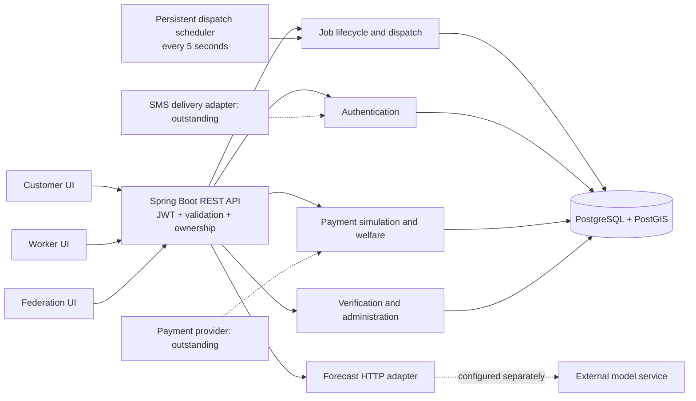
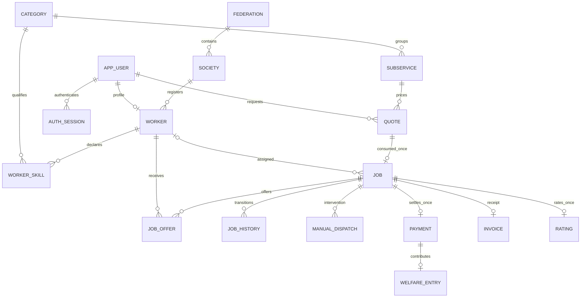
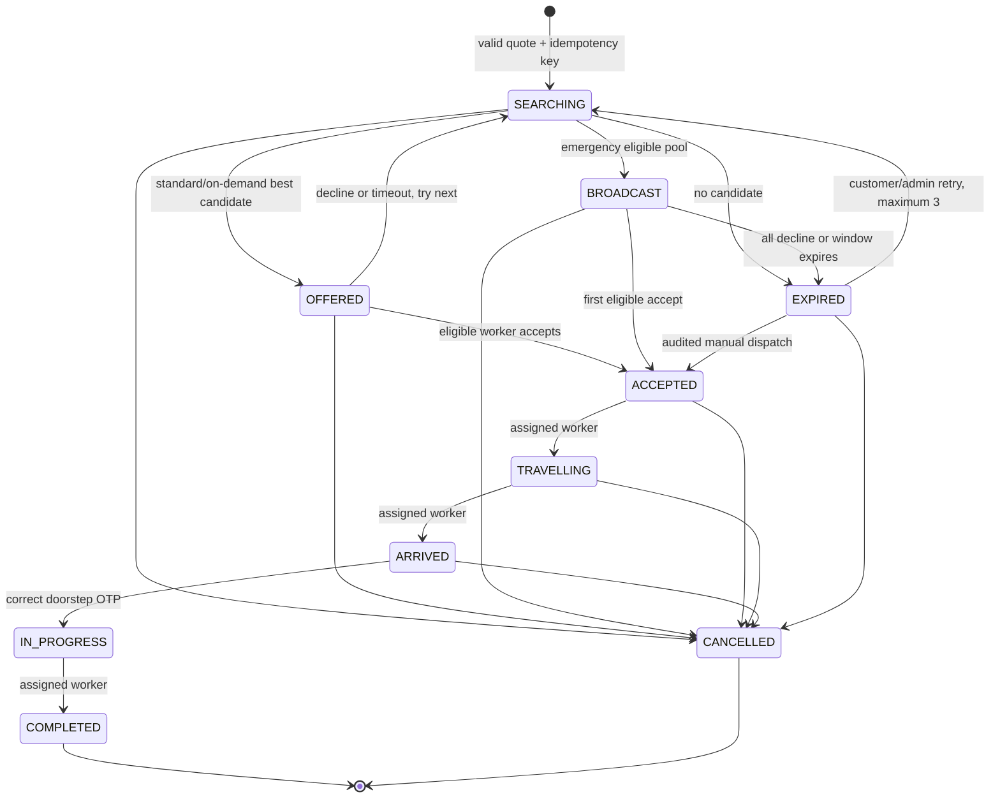
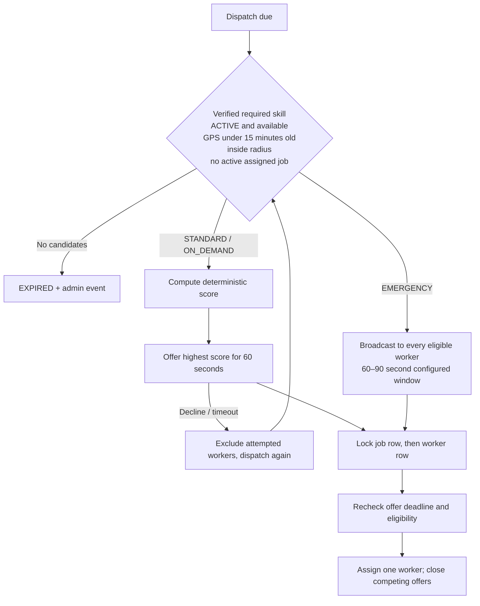
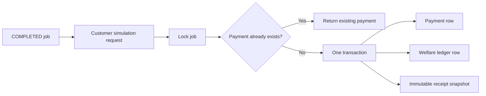

# Architecture and invariants

[Visual guide](index.html) · [API contract](api-contract.md) · [Gap register](gaps.md)

## System boundary



A modular monolith keeps assignment, payments, welfare and audit records in single database transactions. Spring JDBC makes row locks and spatial predicates explicit. There is no Redis, message broker, microservice deployment or hidden in-memory job queue.

## Data relationships



Notifications and administrator audit events are durable rows. UAN is encrypted using AES-GCM, with a keyed fingerprint for deduplication and a last-four representation for display. Full UAN never appears in response DTOs. GPS stores the latest point and timestamp, not a movement trail.

## Job state machine



Customer or admin can cancel before work starts. Cancellation after `IN_PROGRESS`, worker cancellation, disputes and refunds require additional policy and implementation. A scheduled job stays `SEARCHING` until 15 minutes before its scheduled time; it does not reserve a worker or guarantee capacity.

## Matching and atomic acceptance



| Signal | Definition |
|---|---|
| Proximity | `max(0, 1 - distanceMeters / dispatchRadiusMeters)` |
| Rating | `(averageRating - 1) / 4`; initial average is 3 |
| Load | `0.5 × min(todayCompleted/8,1) + 0.3 × min(last7DaysCompleted/40,1) + 0.2 × (1-min(idleHours/24,1))` |
| Final score | `0.5 × proximity + 0.3 × rating - 0.2 × load` with configurable weights |
| Tie | Worker UUID ascending, deterministic |
| Emergency | No score; broadcast breakdown records distance and mode |

Busy workers are excluded before scoring. Daily counts follow the database timezone (default UTC); the normalization constants are provisional product choices. Weights and a policy version are recorded in offer breakdowns. Pricing is snapshotted at quote creation; scoring weights are read at dispatch time. Default radii: 10 km standard/on-demand, 5 km emergency. PostGIS geography predicates measure meters and use spatial indices.

```mermaid
sequenceDiagram
  participant C as Customer
  participant API as API
  participant DB as PostgreSQL
  participant W as Worker
  C->>API: Create job + Idempotency-Key
  API->>DB: Transaction + customer/key advisory lock
  API->>DB: Lock quote; validate owner, expiry and one-time use
  API->>DB: Insert job, offers, history and events
  DB-->>C: Committed job view
  W->>API: Accept offer
  API->>DB: Lock job then worker; recheck eligibility
  API->>DB: Assign worker; mark other offers TAKEN
  DB-->>W: Assigned job
  Note over API,DB: Partial unique index forbids two active jobs per worker
```

Identical booking retries return the existing current job view; reusing the key with a different payload returns 409. This is not blanket idempotency for every mutation. A quote can create at most one job. `FOR UPDATE SKIP LOCKED` lets dispatch schedulers share due jobs without duplicating work. Each tick handles at most 30 jobs, so deadline processing can lag under load; acceptance itself rejects expired offers.

## Doorstep authorization

```mermaid
sequenceDiagram
  participant W as Assigned worker
  participant API as Backend
  participant C as Owning customer
  W->>API: POST arrive
  API->>API: Create encrypted six-digit OTP, 10-minute expiry
  C->>API: GET doorstep-code
  API-->>C: OTP + expiry + attempts remaining
  C-->>W: Share code at doorstep
  W->>API: POST start {otp}
  API->>API: Lock job; validate expiry and attempts
  API-->>W: IN_PROGRESS, clear OTP
```

Five wrong attempts lock use until expiry and customer renewal. OTP access is customer-only, including when an administrator views the job. OTP demonstrates customer authorization; it does not prove physical co-location.

## Financial transaction



`surplus = gross - base`; `welfare = round(surplus × welfareRate, 2)`; `workerEarning = gross - welfare`; `platformFee = 0`. With a nonnegative surcharge and welfare rate in [0,1], worker earnings never fall below base. Monetary values use decimal arithmetic and HALF_UP rounding. Fixed pricing means gross=base and welfare=0. The simulated receipt is explicitly `DEMONSTRATION_RECEIPT`, `SIMULATED_SUCCEEDED`, `NOT_ASSESSED` for tax; it is not evidence of payment or a compliant tax invoice.
