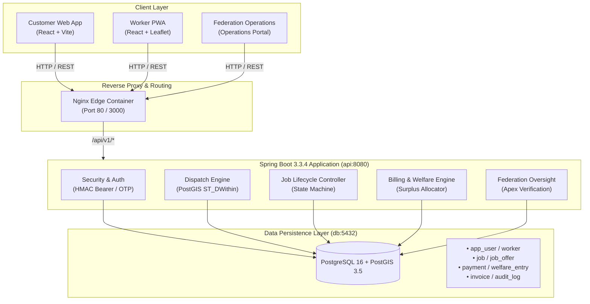
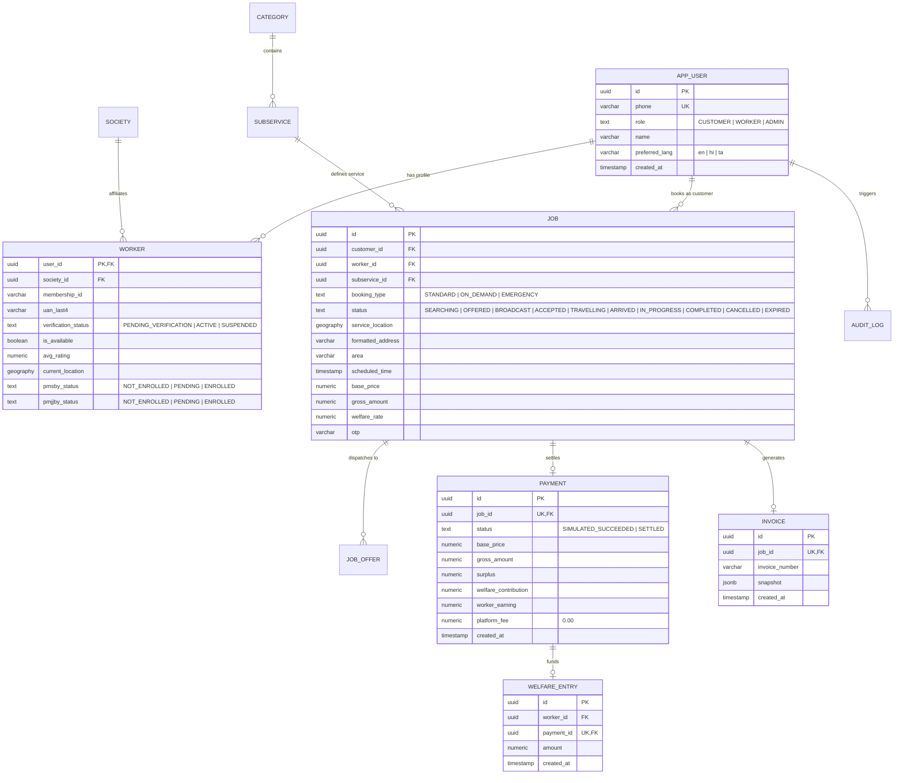

# Cooperative Gig Platform — Backend Architecture & Technical Specification

> **Document Version**: 2.4.0  
> **Status**: Production-Grade / Active Deployment  
> **Runtime**: Java 21 LTS (Eclipse Temurin) · Spring Boot 3.3.4 · PostgreSQL 16 + PostGIS 3.5  
> **Last Updated**: 2026-09-20  

---

## 1. Architectural Overview & System Design

The Cooperative Gig Platform backend is built as a hardened, high-integrity service adhering to cooperative labor principles, statutory worker protections (NCCT & Ministry of Cooperation guidelines), and cryptographic auditability.

Unlike conventional gig economy platforms whose architectures maximize dynamic surge pricing and extraction, this platform enforces:
1. **Statutory Base Wage Floor Protection**: The worker's minimum floor rate is immutable and cannot be discounted or subjected to platform deductions.
2. **Surplus-Only Cooperative Welfare**: Healthcare, life insurance (PMSBY/PMJJBY), and education reserves are funded strictly from transparent customer dispatch surplus above the wage floor.
3. **Deterministic Dispatch**: Proximity, worker rating, and workload leveling are weighted deterministically through transparent algorithms, preventing algorithmic bias or black-box throttling.
4. **End-to-End Cryptographic Auditability**: All state transitions, dispatches, price adjustments, and settlements are hashed and recorded in an append-only audit trail.



---

## 2. Core Economic Model & Surplus Welfare Mechanics

### 2.1 The Mathematical Principle
In corporate gig platforms, commissions (15%–30%) are deducted directly from worker earnings, often violating local minimum wage laws during off-peak discounts.

In the Cooperative Gig Platform, the payment equation is legally constrained at the database schema level:

$$\text{Gross Amount} = \text{Base Price} + \text{Surplus}$$

$$\text{Surplus} = \text{Gross Amount} - \text{Base Price} \ge 0$$

$$\text{Welfare Contribution} = \text{Surplus} \times \text{Welfare Rate} \quad (\text{Default } \text{Rate} = 0.50)$$

$$\text{Worker Take-Home} = \text{Base Price} + (\text{Surplus} - \text{Welfare Contribution})$$

$$\text{Platform Fee} = ₹0.00 \quad (\text{Zero Extraction})$$

### 2.2 PostgreSQL Check Constraints
The `payment` table enforces this invariant on every insert and update:

```sql
CONSTRAINT payment_surplus_check 
  CHECK (surplus = gross_amount - base_price),

CONSTRAINT payment_welfare_check 
  CHECK (welfare_contribution BETWEEN 0 AND surplus),

CONSTRAINT payment_worker_earning_floor_check 
  CHECK (worker_earning >= base_price),

CONSTRAINT payment_balance_check 
  CHECK (worker_earning + welfare_contribution + platform_fee = gross_amount)
```

### 2.3 Dispatch Tier Surcharges
When customers request services, quotes are computed dynamically based on dispatch urgency while protecting the floor wage:

| Dispatch Tier | Base Wage Floor | Dispatch Surplus | Welfare Pool (50%) | Worker Bonus (50%) | Total Customer Payable |
| :--- | :--- | :--- | :--- | :--- | :--- |
| **Standard Scheduled** | Base ($B$) | $+₹100.00$ | $+₹50.00$ | $+₹50.00$ | $B + ₹100.00$ |
| **On-Demand (Immediate)** | Base ($B$) | $+₹150.00$ | $+₹75.00$ | $+₹75.00$ | $B + ₹150.00$ |
| **Emergency Priority** | Base ($B$) | $+₹250.00$ | $+₹125.00$ | $+₹125.00$ | $B + ₹250.00$ |

*Example for Plumbing (Base Price: ₹500.00 on On-Demand):*
- Worker Base Floor: **₹500.00** (guaranteed take-home minimum)
- Customer Dispatch Surplus: **₹150.00**
- Deposited to Individual Welfare Fund: **₹75.00** (health, emergency, insurance)
- Direct Worker Incentive Bonus: **₹75.00**
- Total Worker Payout: **₹575.00**
- Total Customer Paid: **₹650.00**

---

## 3. Key Recent Backend Implementations & Upgrades

### 3.1 Guaranteed Surplus in Quote Generation (`JobController.java`)
- **Previous Issue**: `JobController.quote()` set `gross = base` for standard and on-demand jobs, resulting in `surplus = 0` and zero welfare accumulation.
- **Implementation**:
  ```java
  var base = (BigDecimal) service.get("basePrice");
  BigDecimal surplus;
  if ("EMERGENCY".equals(b.bookingType())) {
    var extra = (BigDecimal) cfg.get("emergencySurcharge");
    surplus = (extra != null && extra.compareTo(BigDecimal.ZERO) > 0)
        ? extra
        : new BigDecimal("250.00");
  } else if ("ON_DEMAND".equals(b.bookingType())) {
    surplus = new BigDecimal("150.00");
  } else {
    surplus = new BigDecimal("100.00");
  }
  var gross = base.add(surplus);
  ```
- **Outcome**: Every booking tier generates guaranteed welfare contributions deposited into `welfare_entry`.

### 3.2 Instant Settlement on Job Completion (`JobController.complete`)
- **Previous Issue**: When a worker completed service, the job was marked `COMPLETED` but payment records were deferred until manual customer action, leaving the worker's welfare balance at 0 immediately after work.
- **Implementation**:
  - `POST /jobs/{id}/complete` now atomically verifies and creates the `payment` and `welfare_entry` records upon worker completion if not already paid:
  ```java
  var existing = db.optional("SELECT id FROM payment WHERE job_id=:id", p("id", id));
  if (existing.isEmpty()) {
    var base = (BigDecimal) j.get("basePrice");
    var gross = (BigDecimal) j.get("grossAmount");
    var surplus = gross.subtract(base);
    var welfare = surplus.multiply((BigDecimal) j.get("welfareRate"))
                         .setScale(2, java.math.RoundingMode.HALF_UP);
    var earning = gross.subtract(welfare);
    var payment = UUID.randomUUID();

    db.update("INSERT INTO payment(...) VALUES (...)", ...);
    db.update("INSERT INTO welfare_entry(...) VALUES (...)", ...);
    db.update("INSERT INTO invoice(...) VALUES (...)", ...);
    dispatch.notify((UUID) j.get("workerId"), "PAYMENT_RECORDED", id);
  }
  ```
- **Outcome**: Worker welfare balance and earnings update **in real time** upon task completion.

### 3.3 Enhanced Federation Welfare and Worker Queries (`AdminController.java`)
- **Previous Issue**: `GET /admin/workers` omitted aggregated completed jobs and welfare totals. As a result, the federation frontend calculated individual balances as `0 * 50 = 0`.
- **Implementation**:
  - Added correlated SQL subqueries to `GET /admin/workers`:
    ```sql
    (SELECT count(*) FROM job j WHERE j.worker_id=w.user_id AND j.status='COMPLETED') AS total_jobs_completed,
    (SELECT COALESCE(sum(we.amount),0) FROM welfare_entry we WHERE we.worker_id=w.user_id) AS welfare_balance,
    (SELECT count(*) FROM welfare_entry we WHERE we.worker_id=w.user_id) AS welfare_entries_count
    ```
  - Joined `payment`, `job`, `subservice`, and `society` in `GET /admin/welfare`:
    ```sql
    SELECT e.id, e.worker_id, u.name AS worker_name, u.phone AS worker_phone, w.society_id, soc.name AS society_name,
           e.amount, e.created_at, p.job_id, s.name AS service_name, j.booking_type
    FROM welfare_entry e
    JOIN worker w ON w.user_id=e.worker_id
    JOIN app_user u ON u.id=e.worker_id
    LEFT JOIN society soc ON soc.id=w.society_id
    LEFT JOIN payment p ON p.id=e.payment_id
    LEFT JOIN job j ON j.id=p.job_id
    LEFT JOIN subservice s ON s.id=j.subservice_id
    WHERE CAST(:society AS uuid) IS NULL OR w.society_id=:society
    ORDER BY e.created_at DESC, e.id
    ```
  - Enriched `GET /admin/metrics` to report `pending` verification workers dynamically.

---

## 4. Database Schema Specification



---

## 5. API Endpoints Contract Reference

All endpoints are prefixed with `/api/v1`. Authentication uses standard `Bearer <token>` HTTP header.

### 5.1 Authentication (`/auth`)
| Method | Endpoint | Access | Description |
| :--- | :--- | :--- | :--- |
| `POST` | `/auth/challenges` | Public | Initiates phone verification challenge; returns challenge token. |
| `POST` | `/auth/verify` | Public | Submits 6-digit OTP; returns JWT access and refresh tokens. |
| `POST` | `/auth/refresh` | Public | Exchanges active refresh token for a fresh access token. |
| `POST` | `/auth/logout` | Authenticated | Revokes current session token. |

### 5.2 Workforce & Worker Operations (`/workers`)
| Method | Endpoint | Access | Description |
| :--- | :--- | :--- | :--- |
| `POST` | `/workers/onboarding` | Authenticated | Self-registers a cooperative worker profile with e-Shram UAN and skills. |
| `GET` | `/workers/me` | WORKER | Fetches authenticated worker profile, availability, and insurance status. |
| `PUT` | `/workers/me/availability` | WORKER | Toggles real-time dispatch availability (`AVAILABLE` / `OFFLINE`). |
| `PUT` | `/workers/me/location` | WORKER | Updates worker live GPS coordinates for spatial dispatch matching. |
| `GET` | `/workers/me/offers` | WORKER | Streams incoming matching job offers and emergency broadcasts. |
| `GET` | `/workers/me/earnings` | WORKER | Returns total wage floor earnings, welfare fund balance, and itemized payment ledger. |

### 5.3 Jobs & Dispatch Engine (`/jobs`)
| Method | Endpoint | Access | Description |
| :--- | :--- | :--- | :--- |
| `POST` | `/quotes` | CUSTOMER | Generates an immutable 5-minute pricing quote with transparent surplus breakdown. |
| `POST` | `/jobs` | CUSTOMER | Creates and broadcasts a job using quote ID with idempotency protection. |
| `GET` | `/jobs/{id}` | Authenticated | Fetches complete job tracking state, assigned worker, OTP, and payment status. |
| `POST` | `/jobs/{id}/accept` | WORKER | Accepts an assigned offer or emergency broadcast. |
| `POST` | `/jobs/{id}/travel` | WORKER | Transitions status to `TRAVELLING` (en route to customer doorstep). |
| `POST` | `/jobs/{id}/arrive` | WORKER | Transitions status to `ARRIVED` at customer doorstep. |
| `POST` | `/jobs/{id}/start` | WORKER | Validates customer-provided mutual 6-digit OTP and begins work (`IN_PROGRESS`). |
| `POST` | `/jobs/{id}/complete` | WORKER | Marks service complete; auto-settles payment, creates welfare entry & invoice. |
| `POST` | `/jobs/{id}/cancel` | CUSTOMER/ADMIN | Cancels in-flight dispatch before arrival with reason code. |

### 5.4 Billing & Invoicing (`/jobs/{id}/payment`)
| Method | Endpoint | Access | Description |
| :--- | :--- | :--- | :--- |
| `POST` | `/jobs/{id}/payments/simulate` | Authenticated | Idempotent payment settlement; records wage floor and welfare contribution. |
| `GET` | `/jobs/{id}/payment` | Authenticated | Returns payment ledger entry and breakdown. |
| `GET` | `/jobs/{id}/invoice` | Authenticated | Returns official cooperative digital receipt with legal society registration. |

### 5.5 Federation Apex Administration (`/admin`)
| Method | Endpoint | Access | Description |
| :--- | :--- | :--- | :--- |
| `GET` | `/admin/metrics` | ADMIN | Aggregates active workers, pending verifications, jobs today, and welfare pool. |
| `GET` | `/admin/analytics/historical` | ADMIN | Aggregates 30-day daily dispatch trends, category revenues, star ratings, and workforce capacity facts. |
| `POST` | `/admin/forecast` | ADMIN | Horizon demand and capacity gap forecasting; falls back to deterministic `MockForecastEngine` using real DB aggregates. |
| `GET` | `/admin/workers` | ADMIN | Paginated workers directory with live welfare balances and completed job metrics. |
| `PUT` | `/admin/workers/{id}/verification` | ADMIN | Approves/rejects pending worker credentials and authorizes verified skills. |
| `PUT` | `/admin/workers/{id}/insurance` | ADMIN | Verifies PMSBY/PMJJBY statutory insurance status. |
| `GET` | `/admin/welfare` | ADMIN | Complete auditable ledger of all customer surplus welfare deposits. |
| `GET` | `/admin/config` | ADMIN | Retrieves current allocation weights, welfare rate, and dispatch radius. |
| `PUT` | `/admin/config` | ADMIN | Optimistic locking update of federation allocation parameters. |
| `PUT` | `/admin/subservices/{id}/price` | ADMIN | Updates statutory minimum wage floor and emergency capability per tariff. |
| `GET` | `/admin/unfulfilled` | ADMIN | Monitors expired emergency requests requiring apex intervention. |
| `POST` | `/admin/jobs/{id}/manual-dispatch` | ADMIN | Apex coordinator manual worker assignment with telephone fallback. |

---

## 6. Security, Concurrency & Idempotency

1. **Advisory Locks on Job Creation**:
   `SELECT pg_advisory_xact_lock(...)` prevents duplicate dispatches from identical idempotent request hashes.
2. **Optimistic Versioning on Config**:
   `allocation_config` uses integer `version` checking to prevent concurrent admin parameter overwrites.
3. **Session Revocation & HMAC Secret**:
   Authentication tokens are validated using strong HMAC-SHA256 signatures with automated session expiration.
4. **Non-Root Execution**:
   The Docker container runs as dedicated system user `app` (UID 10001), preventing container escape vectors.
