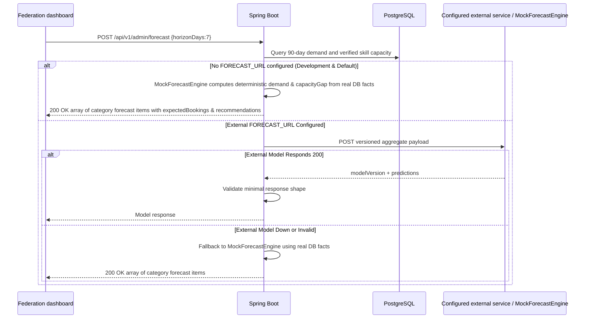

# Forecast adapter — provisional contract

**Implemented:** admin-only HTTP adapter. **Not supplied:** trained model, model hosting, agreed ML-team schema, area-level forecast, shortage recommendation engine, accuracy evidence.



## Request sent to model

```json
{
  "schemaVersion": 1,
  "horizonDays": 7,
  "dailyDemand": [{"day": "2026-09-18", "subserviceId": "00000000-0000-0000-0000-000000000001", "bookings": 12}],
  "capacity": [{"categoryId": "00000000-0000-0000-0000-000000000002", "workers": 4}]
}
```

IDs here are placeholders. Daily demand counts booked jobs, including unsuccessful/cancelled demand; it is not a count of fulfilled work. Capacity counts ACTIVE verified workers by category, not guaranteed current availability. Multi-skilled workers can appear in multiple categories. No personal names, phones, UANs or individual GPS points are transmitted.

## Expected model response

```json
{
  "modelVersion": "demand-model-1",
  "predictions": [{"date": "2026-09-20", "subserviceId": "00000000-0000-0000-0000-000000000001", "expectedBookings": 8.5}]
}
```

The adapter checks a non-null model version, prediction array, valid date and UUID, and nonnegative numerical expected bookings. It does not yet enforce requested horizon alignment, known service IDs, uniqueness, confidence intervals or accuracy. Unknown additional model fields can pass through. Validate the full contract before accepting a production provider.

| Setting / behavior | Current value |
|---|---|
| `FORECAST_URL` | Empty by default; operator-controlled URL |
| `FORECAST_TOKEN` | Optional bearer credential |
| Connection / request timeout | 3 seconds / 5 seconds |
| Redirects | Disabled |
| Response check | HTTP 200, JSON shape, maximum 1,000,000 characters after body read |
| Request horizon | 1–30 days |

## Remaining acceptance gate

Agree on model schema with the ML team; add area and time-bucket dimensions, capacity semantics, confidence intervals and shortage rules. Add a bounded streaming body limit, trusted host/egress policy and provider contract tests. Evaluate historical holdout accuracy and drift. UI must show “Forecast unavailable” on 503 and never display fabricated predictions as a successful model response.
