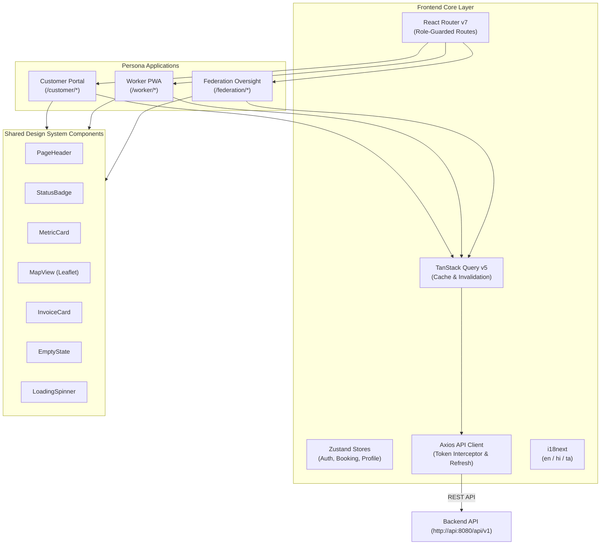
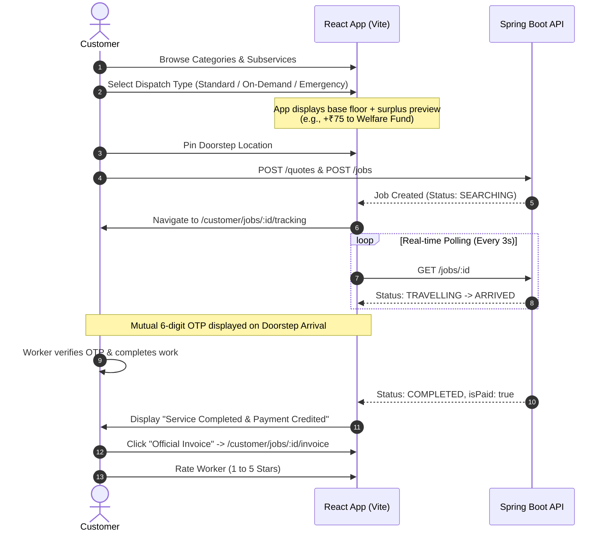
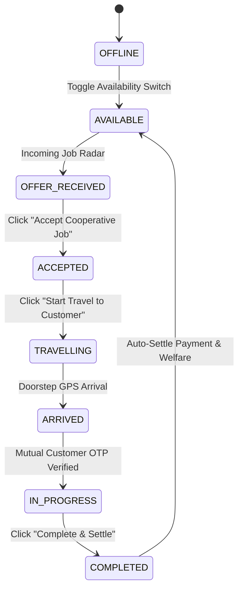

# Cooperative Gig Platform — Frontend Architecture & Technical Specification

> **Document Version**: 2.4.0  
> **Status**: Production-Grade / Active Deployment  
> **Framework**: React 19 · TypeScript 5.7 · Vite 8 · Tailwind CSS v4 · TanStack Query v5 · React Router v7 · Lucide Icons · Leaflet  
> **Last Updated**: 2026-09-20  

---

## 1. System Philosophy & Architecture

The Cooperative Gig Platform frontend is designed around three distinct, sovereign personas operating within a federated cooperative ecosystem:

1. **Citizen Customer Experience**: Discovering verified services with zero hidden commissions, configuring dispatch urgency with transparent welfare surpluses, tracking live doorstep arrivals, and receiving certified digital invoices.
2. **Citizen Worker PWA**: Dignity-centered interface providing guaranteed base-floor wage protection, real-time dispatch matching, doorstep OTP verification, instant completion settlement, and transparent welfare fund tracking.
3. **Federation Operations & Governance**: Apex oversight portal providing real-time regional liquidity monitoring, worker credential verification, tariff configuration, manual dispatch intervention, and auditable welfare fund ledgers.



---

## 2. Directory Structure & Modular Breakdown

The codebase strictly adheres to feature-driven separation with dedicated services and type safety:

```
frontend/
├── Dockerfile                  # Multi-stage production build (Node.js -> Nginx)
├── nginx.conf                  # Production reverse proxy and SPA routing
├── src/
│   ├── components/
│   │   ├── customer/           # Customer components
│   │   │   ├── BookingConfirmation.tsx    # Itemized wage floor + surplus breakdown
│   │   │   ├── BookingTypeSelector.tsx    # Standard / On-Demand / Emergency selector
│   │   │   ├── JobTrackingCard.tsx        # In-flight lifecycle, OTP & settled invoice CTA
│   │   │   ├── LocationPicker.tsx         # Map-based doorstep pin selector
│   │   │   ├── PaymentScreen.tsx          # Ethical settlement & simulated payment methods
│   │   │   ├── ServiceCategoryGrid.tsx    # Category cards with verified badge
│   │   │   └── SubserviceList.tsx         # Subservices with wage-floor guarantees
│   │   ├── worker/             # Worker components
│   │   │   ├── EarningsSummary.tsx        # Wage-floor transparency & recent settlements
│   │   │   ├── JobDetailWorker.tsx        # Active task roadmap & mutual OTP verification
│   │   │   ├── JobOfferCard.tsx           # Incoming radar offers & emergency broadcasts
│   │   │   ├── WelfareStatusCard.tsx      # Individual welfare balance & statutory insurance
│   │   │   └── WorkerStatusToggle.tsx     # Instant AVAILABLE / OFFLINE toggle
│   │   ├── federation/         # Federation governance components
│   │   │   ├── ConfigurationPanel.tsx     # Tariff updates & allocation weights
│   │   │   ├── EmergencyDispatchPanel.tsx # Unfulfilled emergency radar & manual override
│   │   │   ├── JobDetailFederation.tsx    # Deterministic scoring inspection & audit log
│   │   │   ├── JobsTable.tsx              # Regional dispatch grid with society filters
│   │   │   ├── VerificationQueue.tsx      # Worker onboarding approval with skill auth
│   │   │   └── WelfareAdmin.tsx           # Apex welfare pool & member accounts ledger
│   │   └── shared/             # Reusable design system primitives
│   │       ├── EmptyState.tsx
│   │       ├── ErrorState.tsx
│   │       ├── InvoiceCard.tsx
│   │       ├── JobProgressBar.tsx
│   │       ├── LoadingSpinner.tsx
│   │       ├── MapView.tsx
│   │       ├── MetricCard.tsx
│   │       ├── OTPDisplay.tsx
│   │       ├── PageHeader.tsx
│   │       └── StatusBadge.tsx
│   ├── hooks/                  # Custom React hooks (React Query abstractions)
│   │   ├── useAuth.ts          # Authentication, role switching, challenges
│   │   ├── useBookingFlow.ts   # Multi-step customer booking state
│   │   ├── useJob.ts           # Real-time job polling & offer listening
│   │   ├── usePayment.ts       # Settlement mutations & digital invoices
│   │   ├── useServiceCatalog.ts# Hierarchical catalog caching
│   │   └── useWorkerProfile.ts # Worker availability & profile sync
│   ├── layouts/                # Persona layout wrappers
│   │   ├── CustomerLayout.tsx  # Customer shell with bottom navigation
│   │   ├── WorkerLayout.tsx    # Worker shell with status bar
│   │   └── FederationLayout.tsx# Operations sidebar shell
│   ├── lib/                    # Utilities, schemas, and API client
│   │   ├── apiClient.ts        # Axios client with bearer interceptors
│   │   ├── events.ts           # Cross-tab communication bus
│   │   ├── queryClient.ts      # TanStack Query client configuration
│   │   ├── schemas.ts          # Zod validation schemas
│   │   ├── serviceTranslation.ts # Localization mappings
│   │   └── utils.ts            # Formatting (currency, dates, tailwind merge)
│   ├── pages/                  # Page route controllers
│   │   ├── auth/               # Sign In, Role Quick-Login, Worker Sign Up
│   │   ├── customer/           # Customer views (Booking, Tracking, Invoice)
│   │   ├── worker/             # Worker views (Dashboard, Jobs, Welfare, Earnings)
│   │   └── federation/         # Federation views (Dashboard, Verification, Tariff)
│   ├── services/               # API service layer (type-safe Axios endpoints)
│   │   ├── authService.ts
│   │   ├── catalogService.ts
│   │   ├── customerService.ts
│   │   ├── federationService.ts
│   │   ├── jobService.ts
│   │   ├── paymentService.ts
│   │   └── workerService.ts
│   └── types/                  # TypeScript interface definitions
│       ├── federation.ts
│       ├── job.ts
│       ├── user.ts
│       └── worker.ts
```

---

## 3. Persona Modules & User Journeys

### 3.1 Customer Experience


#### Key Components:
- **`BookingTypeSelector.tsx`**: Calculates and displays the total price (`Base + Surplus`) for Standard, On-Demand, and Emergency tiers. Features an emerald badge highlighting the exact deposit into the Worker Welfare Fund.
- **`BookingConfirmation.tsx`**: Displays an itemized ledger before final submission:
  1. *Service Base Floor (Guaranteed to Worker)*
  2. *Cooperative Dispatch Surplus* (itemized into Worker Bonus & Welfare Fund)
  3. *Total Amount Payable*
  4. *Worker Total Take-Home*
- **`JobTrackingPage.tsx`**:
  - Automatically isolates running jobs for the `/customer/jobs/active` route.
  - When no in-flight job is running, displays the **"No Live Jobs"** view with a direct **"Browse Services & Book"** CTA and an organized **"Recent Bookings History"** list (with direct invoice download links).
- **`JobTrackingCard.tsx`**:
  - Dynamically switches upon job completion:
    - If `isPaid === true`: Renders green settlement confirmation with **"Official Invoice"** and **"Rate Service"** actions.
    - If `isPaid === false`: Renders **"Proceed to Payment & Invoice"**.

---

### 3.2 Worker PWA Experience



#### Key Components:
- **`WorkerDashboard.tsx`**:
  - Displays real-time availability toggle (`AVAILABLE` / `OFFLINE`).
  - Radar card for matched dispatches and broadcast alerts.
  - Live metric cards showing:
    - *Guaranteed Earnings* (dynamic from `totals.totalEarnings`)
    - *Completed Settlements* (dynamic from `totals.paidJobs`)
    - *Accumulated Welfare Pool* (dynamic from `totals.totalWelfare`)
- **`WorkerWelfarePage.tsx` & `WelfareStatusCard.tsx`**:
  - Connects to `workerService.getEarnings()` on mount.
  - Displays the member's individual welfare balance accrued from customer surplus.
  - Renders statutory insurance status badges (PMSBY ₹2 Lakh accidental cover, PMJJBY ₹2 Lakh term life cover).
  - Itemized welfare contributions ledger showing each completed task's surplus share.
- **`WorkerCompletePage.tsx`**:
  - Confirms work completion, triggers instant backend settlement, and directs the worker to their earnings ledger.

---

### 3.3 Federation Apex Governance Experience

#### Key Components:
- **`FederationDashboard.tsx`**:
  - Dynamic KPI cards (*Active Workers*, *Available Workers*, *Jobs Today*, *Apex Welfare Pool*).
  - Synchronized **"Pending Approvals"** button linked dynamically to the exact count of pending worker verification requests.
- **`WelfareAdmin.tsx` (Member Welfare Accounts Ledger)**:
  - Aggregated Apex Social Security Pool overview showing 100% floor-compliant reserves.
  - Individual Member Welfare Accounts table displaying real database metrics:
    - Worker name, society affiliation, phone number
    - Total completed jobs
    - Cumulative individual welfare balance
    - Itemized transactions filtered per selected worker
- **`VerificationQueue.tsx`**:
  - Apex verification interface to review worker KYC, e-Shram UAN, and authorize certified trade categories.
- **`ConfigurationPanel.tsx`**:
  - Regional tariff management (base wage floor, emergency capabilities) and dispatch weight configuration (proximity, rating, load balance).
- **`FederationForecastPage.tsx` & Analytical Dashboard Suite**:
  - **Historical Records & Trends (`HistoricalAnalyticsChart.tsx`)**:
    - Interactive time horizons (7, 14, 30, 60 days) analyzing actual cooperative dispatch facts.
    - Summary KPI cards (total jobs, completed jobs, emergency dispatches, gross revenue, welfare fund, and average star ratings).
    - Daily volume flex bar graph with stacked overlays for completed and emergency jobs.
    - Trade category performance table displaying recorded volume, completions, active workforce, rating, and revenue.
  - **Gap Capacity Analysis Matrix (`GapCapacityMatrix.tsx`)**:
    - Real-time comparison between verified active cooperative technicians and historical demand.
    - Critical zero-worker shortage alerts identifying vulnerable trade categories.
    - Visual capacity distribution ratios to guide cooperative recruitment and apprenticeship planning.
  - **Demand Forecasting Model (`ForecastDashboard.tsx`)**:
    - Horizon demand predictions and capacity gap indicators (`GAP`, `OPTIMAL`, `SURPLUS`) powered by the deterministic backend model engine based on real database aggregates.

---

## 4. State Management, Data Fetching & Real-Time Sync

### 4.1 TanStack React Query Policies
To eliminate stale data across persona transitions, the platform configures strict real-time freshness:

```typescript
// src/lib/queryClient.ts
export const queryClient = new QueryClient({
  defaultOptions: {
    queries: {
      staleTime: 0,                   // Always fetch fresh state
      refetchOnMount: 'always',       // Re-verify on component mount
      refetchOnWindowFocus: true,     // Re-sync when switching tabs
      retry: 2,
    },
  },
})
```

### 4.2 Cross-Module Invalidation Bus
Mutations automatically trigger cascading invalidations across related queries:

```typescript
// Example: Creating a job or accepting an offer
queryClient.invalidateQueries({ queryKey: ['jobs'] })
queryClient.invalidateQueries({ queryKey: ['workerOffers'] })
queryClient.invalidateQueries({ queryKey: ['workerEarnings'] })
queryClient.invalidateQueries({ queryKey: ['federationMetrics'] })
```

### 4.3 Zustand Lightweight Stores
- **`authStore.ts`**: Persistent authentication session, current active role (`CUSTOMER`, `WORKER`, `ADMIN`), and tokens.
- **`bookingStore.ts`**: Multi-step booking draft with session storage recovery.

---

## 5. Production Nginx Reverse Proxy & Containerization

The production Docker container packages the built assets with an optimized Nginx server configured for single-page routing and transparent backend proxying:

```
Browser Request: http://localhost:3000/api/v1/jobs
       │
       ▼
Nginx (Container: frontend, Port 80)
       │  proxy_pass http://api:8080/api/
       ▼
Spring Boot API (Container: api, Port 8080)
```

### Key Nginx Features in `frontend/nginx.conf`:
1. **SPA Route Fallback**: `try_files $uri $uri/ /index.html;` ensures deep routes (e.g. `/customer/jobs/active`, `/worker/welfare`) load smoothly on browser reload without 404 errors.
2. **Zero-CORS Reverse Proxy**: Proxies `/api/` directly to the `api` container. The browser treats all calls as same-origin.
3. **Asset Caching**: 1-year immutable caching for fingerprinted static bundles (`.js`, `.css`, `.svg`, `.woff2`).
4. **Gzip Compression**: Compresses HTML, JS, CSS, SVG, and JSON payloads over 256 bytes.
