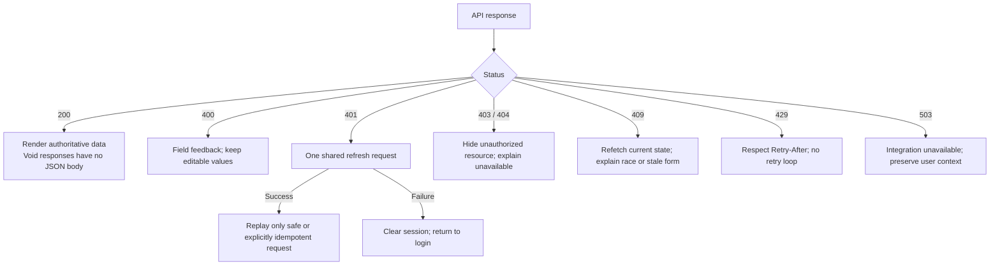

# Frontend team handoff

**The backend is implemented and locally tested. No frontend source exists in this repository, so screen integration is still required.** Replace specification-era mock success paths with these APIs. Use the [interactive lifecycle](index.html), [API contract](api-contract.md) and [remaining gap register](gaps.md) together.

## Contract shared by every screen

| Concern | Backend built | Frontend must implement |
|---|---|---|
| Authentication | Development OTP, 15-minute access token, rotating 30-day refresh token, logout revocation | One auth store, guarded routes, **single-flight refresh**, logout cache purge. Prefer memory access tokens; browser refresh persistence needs a reviewed security design |
| Roles | CUSTOMER, WORKER, ADMIN; ownership enforced server-side | Route by returned user role, not the requested login role; ADMIN cannot be selected at registration |
| Language | Profile stores en/hi/ta; enum and error codes are stable keys | i18next UI strings, translated category/subservice labels keyed by stable codes, localized dates/money; backend catalog names are English |
| API errors | Problem JSON with code, detail and requestId | Loading, empty, stale, retryable error, forbidden and session-expired states; log requestId without secrets |
| Money | INR decimal values; server snapshots quotes and payments | Format server values using Intl.NumberFormat; do not calculate chargeable totals in browser |
| Maps | Validated coordinates, distance in meters, latest worker location | Map provider, permission handling, address selection, freshness label; routing ETA is not supplied |
| Events | GET /events?after=cursor, up to 100 ordered events | Poll while active, advance cursor after processing, drain full batches, invalidate related queries; events are hints, refetch authoritative state |

## Customer screens

| Screen / component | Backend already built | Frontend action and acceptance |
|---|---|---|
| Login | /auth/challenges, /auth/verify | Development-only code display clearly marked; 5-minute challenge expiry, 5-attempt lockout, resend rate limit |
| Home/catalog | /catalog/categories and /catalog/subservices | Render all service choices; store UUIDs; show emergency only when emergencySupported |
| Address | Booking accepts latitude, longitude, formattedAddress, area | Obtain explicit user location choice; geocode with chosen provider; handle denied permission/manual address |
| Booking mode | STANDARD, ON_DEMAND, EMERGENCY | Scheduled picker only for STANDARD, 15 minutes–90 days ahead; send ISO UTC timestamp |
| Confirmation | POST /quotes returns price snapshot expiring in 5 minutes | Show base, gross, currency and expiry; fetch fresh quote after expiry or changed service/type |
| Submit booking | POST /jobs + Idempotency-Key | Generate one UUID key per booking intent and preserve body/key across uncertain network retries; new intent gets a new quote/key |
| Matching | Job statuses SEARCHING/OFFERED/BROADCAST/EXPIRED | Distinguish waiting for scheduled dispatch from searching now; countdown from offerDeadline, then refetch |
| Emergency recovery | /retry, /cancel; admin escalation event | Explain no worker found; offer radius retry, explicit on-demand fallback or cancellation; maximum 3 retries |
| Active job | /jobs/{id}, /tracking | Worker name/rating/society; lifecycle timeline; show last-updated location and fresh flag; do not invent ETA |
| Doorstep OTP | /doorstep-code and /renew | Show only to customer after ARRIVED; expiry + attempts remaining; customer renews after expiry; never send code to analytics |
| Payment | /payments/simulate then /payment | Mark button and success as **simulated payment**; only after COMPLETED; no paid claim before server success |
| Receipt | /invoice JSON snapshot | Render immutable server values, masked UAN, society registration, payment/tax/demo labels; printable frontend view possible, backend PDF absent |
| Rating | /rating, once per completed job | 1–5 stars, optional feedback; handle 409 duplicate; retrieval of existing rating is a tracked API gap |
| History | /jobs?page&size | Paginate arrays; no total count supplied; ownership enforced |

## Worker screens

| Screen / component | Backend already built | Frontend action and acceptance |
|---|---|---|
| Registration | /workers/me/onboarding + /societies + catalog categories | Membership, 12-digit UAN, 1–10 category skills, max 20 certification descriptions; send strings, no document upload API |
| Verification pending | Profile verificationStatus and verificationNote | Pending/rejected/suspended states; block online toggle until ACTIVE; no resubmission promise until backend workflow exists |
| Online toggle | PATCH /workers/me/availability | Request location before going online; update GPS while available using a product-agreed cadence; explain stale location blocks offers |
| Job offers | /workers/me/offers | Service, booking type, area, distance, scheduledTime, deadline, basePrice, grossAmount, workerEarning, welfareContribution; no customer doorstep OTP or address before acceptance |
| Emergency alert | JOB_OFFER events + offer list | Distinct visual alert, user-enabled audible chime; browser autoplay/notification permission handling; no push-delivery guarantee |
| Accept/decline | /accept and /decline | Disable double-click; on 409 remove/refetch card and say offer unavailable; OFFER_CLOSED triggers immediate query refresh |
| Work flow | /travel → /arrive → /start → /complete | Enable only current valid action; send entered customer OTP to /start; reconcile on 409, never locally force next state |
| Earnings | /workers/me/earnings | Separate simulated recorded earnings from real payouts; totals + latest 100 payments, no payout status API |
| Welfare and insurance | Profile PMSBY/PMJJBY + earnings totalWelfare | Explain zero default contributions; show manually recorded enrollment status without claiming government verification |

## Federation screens

| Screen / component | Backend already built | Frontend action and acceptance |
|---|---|---|
| Overview | /admin/metrics?societyId | Registered, verified, pending, online, available, jobsToday, status counts and monetary totals; online can include busy, available excludes busy |
| Society filter | /societies and societyId filters | Dropdown/filter only. Society-scoped jobs/metrics cover assigned workers, so unassigned demand is excluded; label scope explicitly |
| Worker verification | /admin/workers, /verification | Inspect declared skills, verify subset, record note; ACTIVE requires at least one verified skill; show last-four UAN only |
| Insurance | /insurance | Explicit status and evidence reference; manual administrative record |
| Job management | /jobs and /admin/unfulfilled | Surface EXPIRED jobs and emergency urgency; no silent indefinite “matching” state |
| Manual dispatch | /eligible-workers and /manual-dispatch | Candidate list includes phone for actual admin follow-up; capture method/note; handle worker becoming ineligible before submit |
| Allocation inspection | /allocation | Standard weighted breakdown; emergency broadcast mode has null score; manual dispatch explanation; retry offer snapshots are retained in audit |
| Welfare | /admin/welfare | Paginated contribution ledger and society filter; no claims/benefit payout workflow |
| Configuration | /admin/config and /subservices/{id}/price | Only fixed service price and welfare rule in ordinary UI; GET current config, preserve operational fields, PUT with version; 409 means reload/reconcile |
| Forecast | /admin/forecast | Horizon 1–30 days; show unavailable when provider absent; no synthetic chart. Area forecasts and shortage advice are not yet supplied |
| Audit | /admin/audit?after=cursor | Read-only administrative history; preserve actor/action/time; redact sensitive values in UI telemetry |

## Recovery behavior beyond the initial mock screens

TanStack Query should retry reads only with bounded backoff. Do not globally retry POSTs. Use a separate idempotency-aware booking mutation. Refresh calls must be single-flight across concurrent requests; a reused refresh token revokes its entire session family. Cross-tab refresh coordination is required if a refresh token is shared across tabs.

Suggested foreground polling: events and active offers every ~2 seconds, active job every ~3–5 seconds, tracking every ~10 seconds; pause or back off offline/hidden. These are frontend suggestions, not a measured capacity guarantee. Refetch offers on countdown expiry because not every timeout/cancellation emits OFFER_CLOSED. Use expiresAt/offerDeadline for countdowns and refetch at expiry or on resume. Browser clock skew can affect the display; do not let a local countdown authorize a transition.

## Integration acceptance checklist

- [ ] Three role sessions complete login and route to the correct application.
- [ ] Worker onboarding → administrator approval → fresh GPS → online → visible offer.
- [ ] Customer completes each booking type; fixed price remains unchanged.
- [ ] Two worker browsers race to accept; only one wins and the other clears its card.
- [ ] Customer-only doorstep code authorizes start; wrong/expired codes show recovery.
- [ ] Completed job → simulated payment → immutable receipt → rating → worker earnings.
- [ ] No-worker and timeout flows expose retry, cancellation and manual dispatch.
- [ ] Reload, lost connection, expired access token and conflicting admin edits recover safely.
- [ ] English/Hindi/Tamil layouts, keyboard use, small-screen layouts and map permission denial are tested in the actual frontend repository.

These frontend checks have **not** been executed because frontend code was not provided. Share this document with the frontend team; no messages have been sent to other people.
