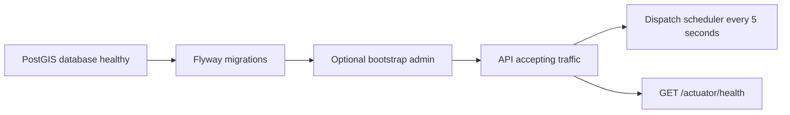

# Operations and deployment preparation

[Quick start](../README.md) · [Gap register](gaps.md) · [Testing](testing.md)

## Environment

| Variable | Local development | Non-development expectation |
|---|---|---|
| `SPRING_PROFILES_ACTIVE` | `dev` | Do not use dev in public environments |
| `DATABASE_URL` | jdbc:postgresql://localhost:5432/cooperative | Private PostgreSQL JDBC URL, TLS appropriate to host |
| `DATABASE_USER` | cooperative | Dedicated least-privilege runtime user; separate migration role needs setup |
| `DATABASE_PASSWORD` | cooperative-dev-only | Required secret |
| `JWT_SECRET` | Known dev fallback | Required high-entropy secret, at least 32 bytes |
| `ENCRYPTION_KEY` | Known dev fallback | Required base64-encoded 32-byte AES key |
| `CORS_ORIGINS` | http://localhost:5173 | Explicit trusted frontend origins, comma-separated |
| `BOOTSTRAP_ADMIN_PHONE` | Optional; compose uses +919999999999 | Approved E.164 initial admin phone; omit after provisioning |
| `FORECAST_URL` | Empty | Optional operator-controlled model URL; implementation contract still provisional |
| `FORECAST_TOKEN` | Empty | Optional bearer token held in secret manager |
| `PORT` | 8080 | Deployment-specific |

Production defaults disable `app.dev-auth` and `app.sandbox-payments`. As delivered, real login challenge delivery and payment processing therefore return 503 until adapters are implemented. Supplying provider credentials alone does not implement those integrations. Compose intentionally uses the dev profile and binds to loopback; it is a local setup, not a production deployment manifest.

Generate independent strong secrets using your platform's secret manager. Do not reuse checked-in dev values. `JWT_SECRET` also keys fingerprints and request hashes: naive rotation breaks token/hash lookup and UAN deduplication consistency. Introduce versioned signing/hash/encryption keys and migration support before planned rotation. Preserve old encryption keys until all encrypted records are safely re-encrypted.

## Startup and health



Migrations enable PostGIS, create constraints/indices and insert demonstration reference data. **V2 seeds demo data unconditionally**, including INR 500 tariffs and fake registrations. Before a real launch, add an approved forward migration replacing this data. Never edit an already-applied migration; Flyway checksums protect migration history. Extension creation may need elevated migration privileges.

Health exposes no internals, but only a basic endpoint is configured. Dedicated liveness/readiness groups, dependency SLOs and ingress health policy must be established for the deployment target. Disable or protect public Swagger/OpenAPI before launch using `springdoc.api-docs.enabled` and `springdoc.swagger-ui.enabled` or ingress access control.

## Build and package

```sh
cd backend
./mvnw verify
java -jar target/services-backend-0.1.0-SNAPSHOT.jar
```

The jar command requires environment variables above and a running database. Docker builds the jar and runs under a non-root account. CI validates on Java 21 with Docker-backed integration tests. Container image digests and dependency vulnerability scanning should be pinned/enforced in a release pipeline; the supplied workflow does not assert those gates passed.

## Recovery runbook

| Symptom | Inspect | Action |
|---|---|---|
| API will not start | DB connectivity, credentials, Flyway error | Restore connectivity or apply a forward migration fix; do not delete Flyway history |
| No offers | Worker verification/skill, availability, GPS timestamp, radius, active assignments | Correct the failed eligibility condition; inspect admin allocation view |
| Offer no longer available | Deadline and latest job state | Refetch; this is an expected race, not a reason to force assignment |
| EXPIRED emergency | /admin/unfulfilled and eligible-workers | Contact eligible worker outside app if appropriate; submit audited manual dispatch |
| OTP locked/expired | Customer code response, expiry | Wait until expiry and let owning customer renew; do not expose/reset through admin UI |
| 401 after refresh | Reused refresh token or revoked family | Sign in again; fix parallel/cross-tab refresh behavior |
| Payment/forecast 503 | Error code, configured profile/provider | Show unavailable; implement or restore provider, never substitute financial/model success |
| Scheduler backlog | Due jobs and oldest deadline | Investigate database latency/candidate scale; current batch is 30/5 seconds |

## Backups, migrations and rollback

Back up database plus separately managed encryption keys. Test restore into an isolated PostGIS instance, verify Flyway state, sample encrypted-data access, monetary invariants and job histories, then test application startup. The delivered repository does not include an executed recovery drill or promised RPO/RTO.

Deploy schema changes using expand/contract compatibility. Rolling back an application does not roll back a schema migration. Use forward repair migrations; never destroy production volumes. `docker compose down` stops local services while preserving the named volume; adding `-v` destroys that local data.

## Observability and data handling

Responses include `X-Request-Id` and no-store cache headers. Problem responses carry requestId for support correlation. Do not log OTPs, tokens, full UAN, encryption keys or raw payment credentials. Current request IDs are not a complete centralized logging/tracing system. Add structured redacted request logs, metrics for dispatch delay/offer acceptance/OTP abuse/provider failure and alerts with operational owners.

Auth challenges, consumed sessions, events, audit and financial histories have no scheduled retention cleanup yet. Approve retention and deletion rules before adding a purge process; financial/audit retention may differ from authentication data. Latest worker GPS is overwritten, but customer job addresses and audit/history remain stored.

## Launch gate

Resolve P0 items in the [gap register](gaps.md), run security and performance review, demonstrate backup restoration, and execute the actual frontend acceptance suite. Local tests establish specific correctness evidence; they do not establish uptime, legal compliance, payment settlement or mobile notification delivery.
